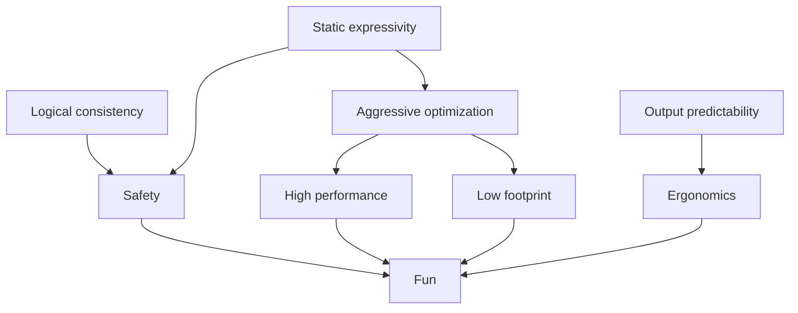

# mce

A programming environment[^1] for Minecraft[^2].

## Goals

## Features

- [ ] Projectional editing
- [x] Dependent types
- [x] Extensional types
- [x] Structural types
- [ ] Occurrence types
- [x] Two-phase types
- [x] Subtyping
- [x] Effect system
- [ ] Cost analysis
- [x] Staging

## References

1. Augustsson, L. (1985). **Compiling Pattern Matching**. FPCA.
2. Le Fessant, F., & Maranget, L. (2001). **Optimizing pattern matching**. ICFP '01.
3. Goguen, H., McBride, C., & McKinna, J. (2006). **Eliminating Dependent Pattern Matching**. Essays Dedicated to Joseph A. Goguen.
4. Levy, P.B. (2006). **Call-by-push-value: Decomposing call-by-value and call-by-name**. Higher-Order and Symbolic Computation, 19, 377-414.
5. Maranget, L. (2008). **Compiling pattern matching to good decision trees**. ML '08.
6. Yang, Y., & Oliveira, B.C. (2017). **Unifying typing and subtyping**. Proceedings of the ACM on Programming Languages, 1, 1 - 26.
7. Winterhalter, T., Sozeau, M., & Tabareau, N. (2019). **Eliminating reflection from type theory**. Proceedings of the 8th ACM SIGPLAN International Conference on Certified Programs and Proofs.
8. Pédrot, P., & Tabareau, N. (2020). **The fire triangle: how to mix substitution, dependent elimination, and effects**. Proceedings of the ACM on Programming Languages, 4, 1 - 28.
9. Cockx, J., & Abel, A. (2020). **Elaborating dependent (co)pattern matching: No pattern left behind**. Journal of Functional Programming, 30.
10. Kokke, W., Siek, J.G., & Wadler, P. (2020). **Programming language foundations in Agda**. Sci. Comput. Program., 194, 102440.
11. Mokhov, A., Mitchell, N., & PEYTON JONES, S. (2020). **Build systems à la carte: Theory and practice**. Journal of Functional Programming, 30.
12. Willsey, M., Nandi, C., Wang, Y.R., Flatt, O., Tatlock, Z., & Panchekha, P. (2021). **egg: Fast and extensible equality saturation**. Proceedings of the ACM on Programming Languages, 5, 1 - 29.
13. András Kovács. (2021). [**Using Two-Level Type Theory for Staged Compilation**](https://github.com/AndrasKovacs/staged/blob/main/types2021/abstract.pdf).
14. Dunfield, J., & Krishnaswami, N.R. (2021). **Bidirectional Typing**. ACM Computing Surveys (CSUR), 54, 1 - 38.
15. Cockx, J., Tabareau, N., & Winterhalter, T. (2021). **The taming of the rew: a type theory with computational assumptions**. Proceedings of the ACM on Programming Languages, 5, 1 - 29.
16. Castagna, G., Laurent, M., Nguyễn, K., & Lutze, M. (2022). **On type-cases, union elimination, and occurrence typing**. Proceedings of the ACM on Programming Languages, 6, 1 - 31.
17. Xie, N., Pickering, M., Löh, A., Wu, N., Yallop, J., & Wang, M. (2022). **Staging with class: a specification for typed template Haskell**. Proceedings of the ACM on Programming Languages, 6, 1 - 30.
18. Daniel Marshall, Michael Vollmer, & Dominic Orchard. (2022). [**Linearity and Uniqueness: An Entente Cordiale**](https://starsandspira.ls/docs/esop22-draft.pdf).

[^1]: A highly integrated pair of a programming language and a development environment.
[^2]: NOT OFFICIAL MINECRAFT PRODUCT. NOT APPROVED BY OR ASSOCIATED WITH MOJANG.
