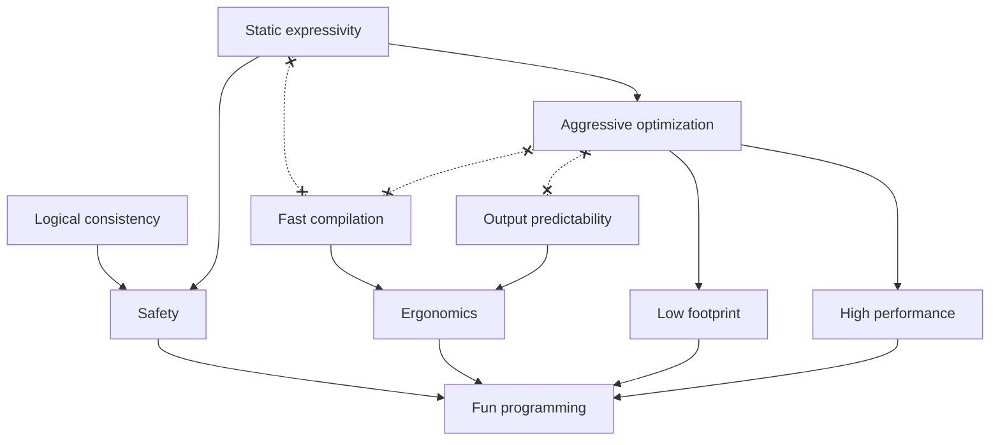

# mce

A programming environment[^1] for Minecraft[^2].

## Goals

## Features

- [ ] Projectional editing
- [x] Dependent types
- [ ] Extensional types
- [x] Structural types
- [ ] Occurrence types
- [x] Two-phase types
- [x] Subtyping
- [x] Effect system
- [ ] Cost analysis
- [x] Staging

[^1]: A highly integrated pair of a programming language and a development environment.
[^2]: NOT OFFICIAL MINECRAFT PRODUCT. NOT APPROVED BY OR ASSOCIATED WITH MOJANG.
